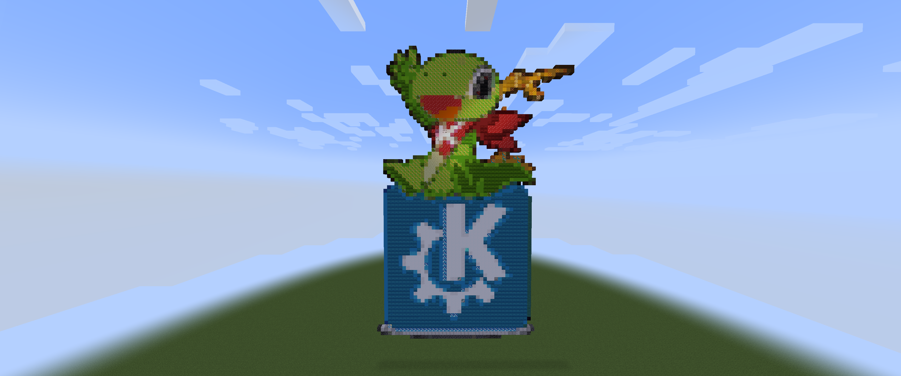
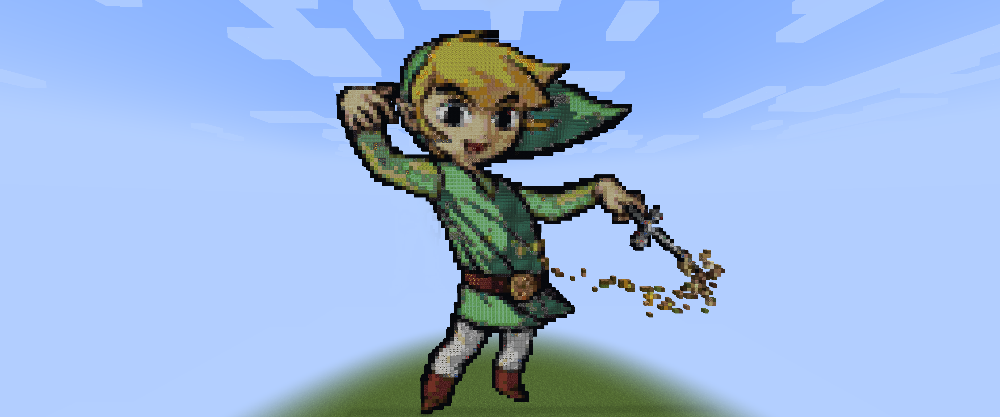
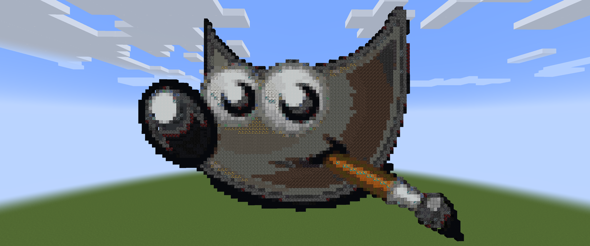

# PixelToBlock
Convert images into block coordinates and place the pixel in your minecraft world.

The program creates a .mcfunction file, which needs to placed into your worlds datapacks folder, or use bukkit.
Example datapack is provided (demo.zip), place that in your world folder, and then place the new .mcfunction file in demo\data\demo\functions
start the game and write /function and auto complete to your chosen image.

You can generate your own block data by removing the blockdata.txt
Extract all blocks from the game and place them in blocks folder, remove images that are not actually blocks and ones with "*_side" or something similar.

